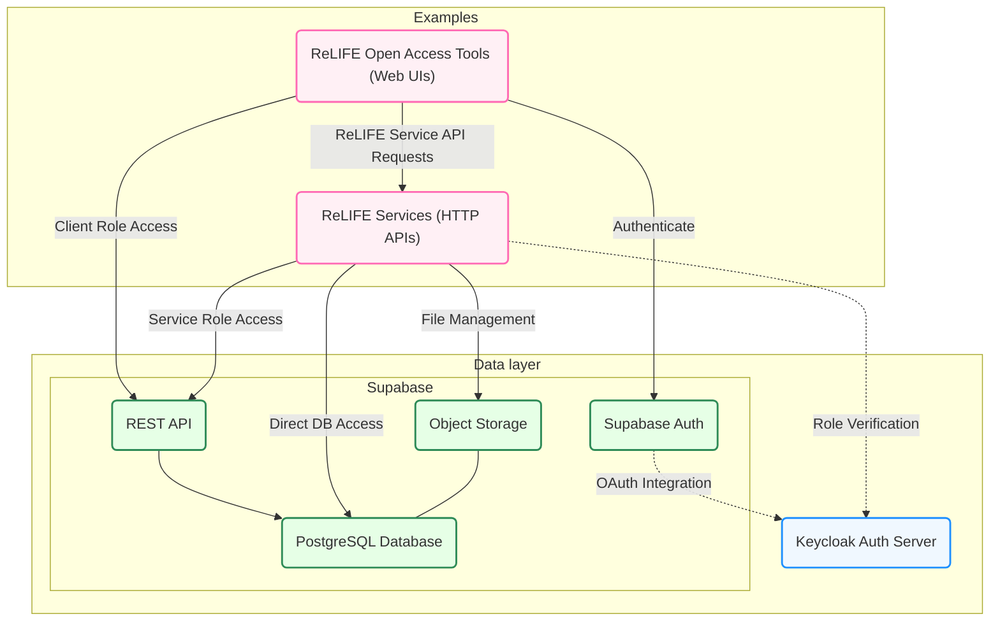

> [!TIP]
> **Who's this repository for?**
> * DevOps engineers who need to deploy, configure, and maintain the **ReLIFE Central Services** (i.e., data layer)
> * ReLIFE developers who need examples of how to integrate **open access tools** (i.e., Web UIs) and **ReLIFE Services** (i.e., HTTP APIs) with the ReLIFE Central Services
> * ReLIFE developers who want to deploy a local instance of the ReLIFE Central Services for development convenience.

# ReLIFE Data Layer

This repository provides the configuration and orchestration needed to run Supabase and Keycloak services using Docker Compose. It includes environment templates, Docker Compose files, and configuration directories for both services. These components work together to deliver database, authentication, authorization, and storage capabilities for the ReLIFE platform - collectively known as the **ReLIFE Central Services** or **Data Layer**.

The following diagram illustrates how the components of ReLIFE fit together:



Additionally, the repository provides examples of how to develop HTTP APIs (i.e., _ReLIFE Services_) and web UIs (i.e., _ReLIFE Open Access Tools_) that integrate with the ReLIFE Platform Data Layer.

## Configuration

> [!IMPORTANT]
> This project's default configuration uses `host.docker.internal` to access the host transparently from both inside and outside the Docker containers. If you're on Linux, please note that `host.docker.internal` is not configured inside Docker containers by default. Additionally, to enable this hostname from outside containers (i.e., from the host itself), you should add an entry to your `/etc/hosts` file to map `host.docker.internal` to `127.0.0.1`.

The configuration is defined via dotenv files, specifically there's an `.env.default` file that contains the default values. You may create a custom `.env` file to override the default values.

## Prerequisites

Before you begin, ensure you have the following tools installed:

- **Docker** - Required for running Supabase, Keycloak, and other containerised services
- **Node.js** - Required for running the web UI and development tools
- [**Task**](https://taskfile.dev/installation/) - Build tool used for running project commands and automation
- [**uv**](https://github.com/astral-sh/uv) - Fast Python package installer and resolver, required for the service API
- **Python** - Required for running the service API
- **Supabase CLI** - Required to run some maintenance tasks when deploying and configuring Supabase

## Deployment

First, you need to create the dotenv file that will contain the JWT tokens for Supabase anonymous and service role access:

```console
task gen-keys
```

Then, you can deploy the central services (Supabase and Keycloak) using the following command:

```console
task central:deploy
```

### Configuring Keycloak

With the Keycloak service now running, you need to set up the Keycloak realm for authentication.

#### Access the Keycloak Admin Dashboard

1. Open the Keycloak admin console at `http://<your-hostname>:${KEYCLOAK_PORT}/admin/`
2. Log in using the admin credentials specified in your environment variables: `KEYCLOAK_ADMIN_USER` and `KEYCLOAK_ADMIN_PASSWORD`

> [!TIP]
> The default Keycloak port is 8080, and both the username and password are initially set to `keycloak`. Ensure to change these defaults in a production environment.

#### Configure the Realm

First, create a realm with the name specified in the `KEYCLOAK_REALM` variable (default is `relife`).

Each _client_ ([as defined by OAuth](https://oauth.net/2/client-types/)) that needs to connect to Supabase services must have a client entry in the _Clients_ section of the realm management dashboard.

##### Create the Frontend Client

By default, at least one client is necessary to enable frontend applications to access Supabase from the browser.

To create the client for frontend applications, you can import the `central-services/keycloak-config/supabase.json` file in the _Clients > Import client_ section of the Keycloak realm dashboard. It's important to note that the default configuration in `supabase.json` **is not final nor secure** and needs to be updated:

1. Update the _valid redirect URIs_. In OAuth, valid redirect URIs are the URLs to which the authorization server (i.e., Keycloak) can send the user after they have authenticated. These URIs are initially set to access the examples in this repository on `localhost`. For production, these should be updated to the public URLs of the frontend applications.
2. Regenerate the client secret in the _Credentials_ section of the _Client details_.

After regenerating the secret, update your `.env` file with the new secret. For example:

```dotenv
KEYCLOAK_SUPABASE_CLIENT_SECRET=6VMhsLstslaAY6DogeOsgT9odH1y64OE
```

Next, restart Supabase:

```console
task central:supabase-deploy
```

With at least one _client_ in place, we can now create users in the realm and set their passwords. These users will be allowed to authenticate into the web applications that utilise any of these _clients_.

> [!NOTE]
> The _Email Verified_ setting should be enabled for users to be allowed to log in.

##### Create a Backend Service Client

For any backend API or service that needs to connect to Supabase, create a separate _confidential client_.

An example configuration for a `service` client is available in the `central-services/keycloak-config/service.json` file, prepared for the example API project in this repository.

For this `service` client, add the `realm-admin` role in the _Service accounts roles_ section. Also, create a new _realm role_ named `relife_admin`. This role corresponds to the default `admin_role_name` setting in the ReLIFE Service API Example. Assign this role to users who need access to admin-only features in the example application.

## Examples

The `example-open-access-tool` directory contains example code demonstrating how to:

- Structure a React application with Supabase authentication
- Initialize and configure the Supabase client
- Implement user login/logout flows using Keycloak as the authentication provider

The `example-service-api` directory contains example code demonstrating how to:

- Structure a FastAPI application with Supabase integration
- Authenticate requests using Keycloak tokens
- Implement role-based access control using Keycloak roles
- Access Supabase data with both user and service role clients
- Upload and manage files using Supabase Storage

Run `task examples-compose-up` to build and run the Docker images for the example open access tool and service API.