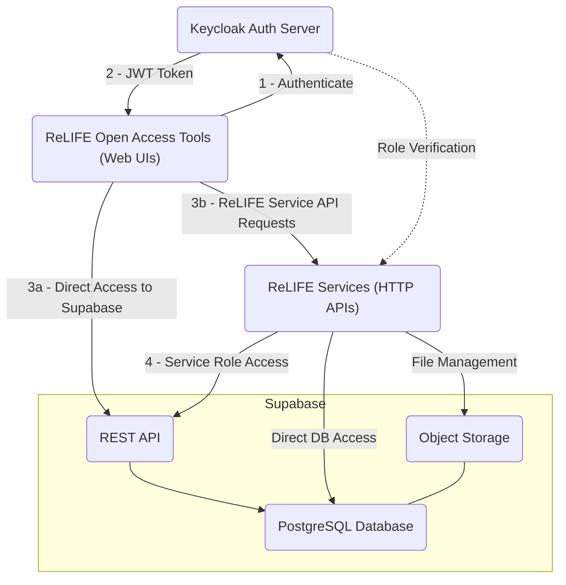

# ReLIFE Data Layer

This repository contains configuration and orchestration files for running Supabase and Keycloak using Docker Compose. It includes environment templates, Docker Compose files for both Supabase and Keycloak, and directories for Supabase migrations, seeds, and Keycloak client configuration JSON files. Together, these components provide database, authentication, authorization, and storage services for the ReLIFE platform, forming what is referred to as the **ReLIFE Platform Data Layer**.

The following diagram illustrates how the components of ReLIFE fit together:



Additionally, the repository provides examples of how to develop HTTP APIs (i.e., _ReLIFE Services_) and web UIs (i.e., _ReLIFE Open Access Tools_) that integrate with the ReLIFE Platform Data Layer.

## Configuration

> [!IMPORTANT]
> This project's default configuration uses `host.docker.internal` to access the host transparently from both inside and outside the Docker containers. If you're on Linux, please note that `host.docker.internal` is not configured inside Docker containers by default. Additionally, to enable this hostname from outside containers (i.e., from the host itself), you should add an entry to your `/etc/hosts` file to map `host.docker.internal` to `127.0.0.1`.

The configuration is defined via dotenv files, specifically there's an `.env.default` file that contains the default values. You may create a custom `.env` file to override the default values.

## Prerequisites

Before you begin, ensure you have the following tools installed:

- **Docker** - Required for running Supabase, Keycloak, and other containerised services
- **Node.js** - Required for running the web UI and development tools
- [**Task**](https://taskfile.dev/installation/) - Build tool used for running project commands and automation
- [**uv**](https://github.com/astral-sh/uv) - Fast Python package installer and resolver, required for the service API
- **Python** - Required for running the service API

## Deployment

First, you need to create the dotenv file that will contain the JWT tokens for Supabase anonymous and service role access:

```console
task gen-keys
```

Then, you can deploy the central services (Supabase and Keycloak) using the following command:

```console
task central:deploy
```

### Configuring the Keycloak Realm

Now that the Keycloak service is running, you need to configure the Keycloak realm for authentication.

Access the Keycloak admin console at `http://localhost:${KEYCLOAK_PORT}/admin/` (the default port is 8080). Log in using the admin credentials defined in your environment variables: `KEYCLOAK_ADMIN_USER` and `KEYCLOAK_ADMIN_PASSWORD`. By default, both username and password are set to `keycloak`.

Follow these steps to configure the realm:

> [!NOTE]
> These configuration steps also include the steps to support the examples available in this repository: the open access tool (i.e., frontend) and the service API (i.e., backend). Generally speaking, you only need to create a realm, the `supabase` client, and a client for each ReLIFE Service API that needs to be integrated.

1. Create a new realm named `relife`.
2. In the _Clients_ section, click _Import client_ and import all client configurations from the JSON files in the `central-services/keycloak-config` directory.
3. For the `service` client, add the `realm-admin` role under the _Service accounts roles_ section.
4. Create a new user in the realm and set their password—this user will be used to test authentication in the open access tool web applications. Make sure to enable the _Email Verified_ setting for this user.
5. Create a new _realm role_ named `relife_admin` (this matches the default `admin_role_name` setting in the ReLIFE Service API Example). Assign this role to the user if you want them to have access to the admin-only features in the example application.

For security, it's recommended to regenerate the client secrets. You can do this in the _Credentials_ section of each client's configuration. Copy the new secrets to your `.env` file to update the appropriate environment variables. For example:

```dotenv
KEYCLOAK_SUPABASE_CLIENT_SECRET=6VMhsLstslaAY6DogeOsgT9odH1y64OE
KEYCLOAK_RELIFE_SERVICE_CLIENT_SECRET=VnCufvj4jSbd6gS5tadQLT0oEyliGyVU
```

If you regenerate the secrets, you need to redeploy Supabase:

```console
task central:supabase-deploy
```

## Examples

The `example-open-access-tool` directory contains example code demonstrating how to:

- Structure a React application with Supabase authentication
- Initialize and configure the Supabase client
- Implement user login/logout flows using Keycloak as the authentication provider

The `example-service-api` directory contains example code demonstrating how to:

- Structure a FastAPI application with Supabase integration
- Authenticate requests using Keycloak tokens
- Implement role-based access control using Keycloak roles
- Access Supabase data with both user and service role clients
- Upload and manage files using Supabase Storage

Run `task examples-compose-up` to build and run the Docker images for the example open access tool and service API.